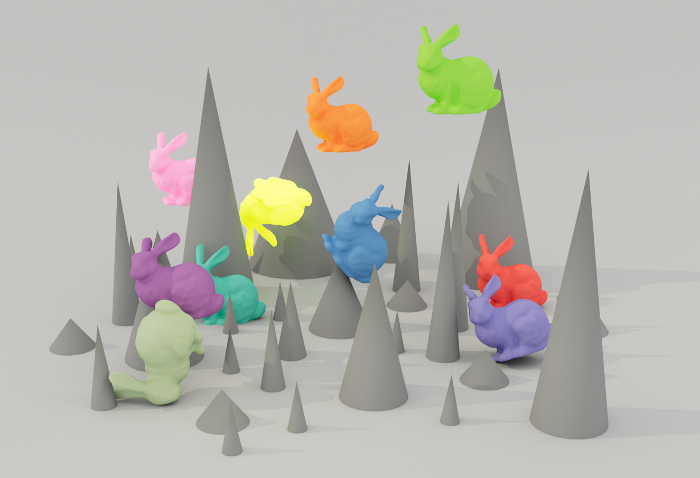
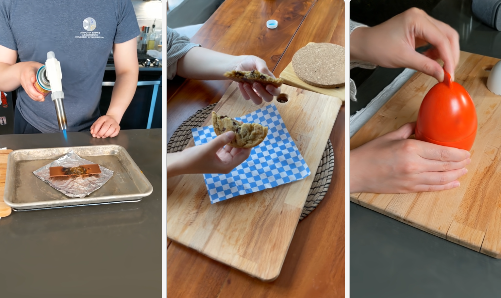
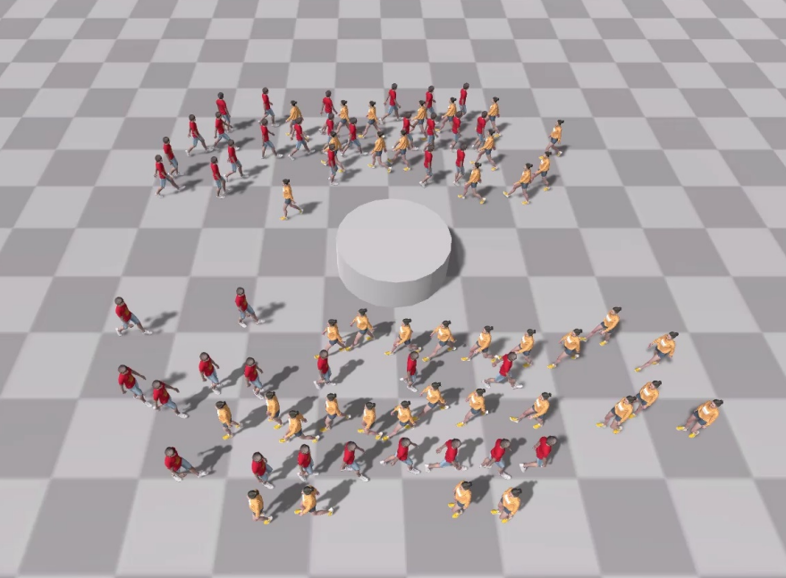
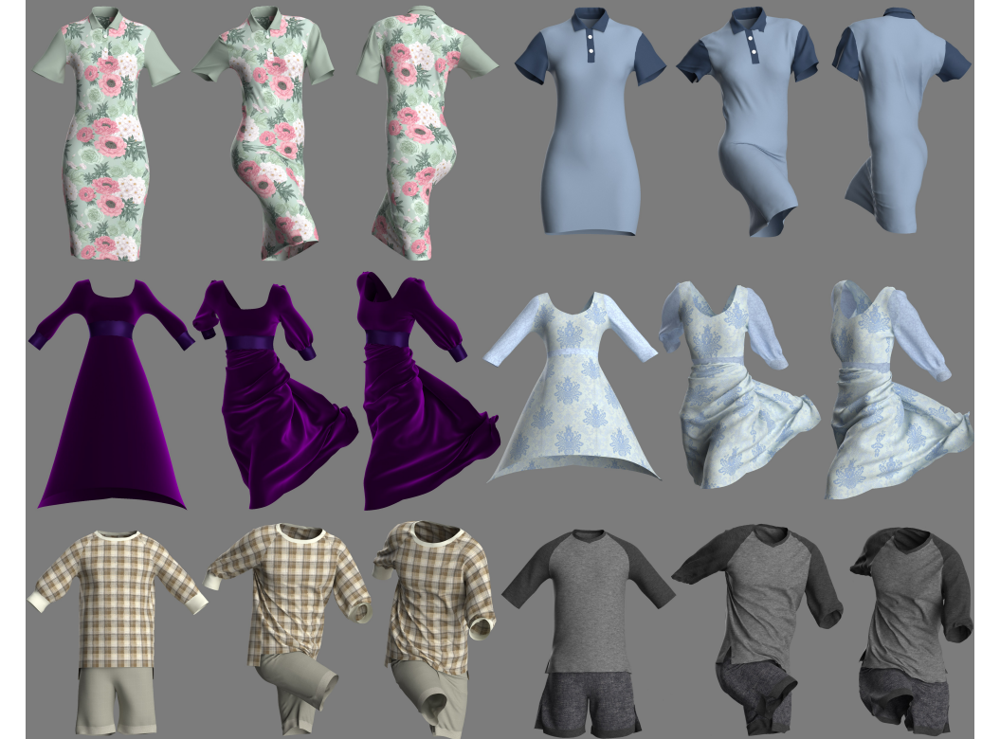

## About Me

I am Yuqing Zhang, a Master's student in State Key Lab of CAD&CG at Zhejiang University, advised by Prof. [Xiaogang Jin](http://www.cad.zju.edu.cn/home/jin). I obtained my Bachelor degrees in Digital Media Technology from Zhejiang University in 2022.

**Research Interest:** Texture generation, Simulation.

**Address:** Zijingang Campus of Zhejiang University, 866 Yuhangtang Rd, Hangzhou 310058, P.R. China.

**Contact:** [3180102110@zju.edu.cn](mailto:3180102110@zju.edu.cn) / [zyq2221148@gmail.com](mailto:zyq2221148@gmail.com)

## Publications
*Equal contribution †Corresponding author

  

  

  <b>DreamMat: High-quality PBR Material Generation with Geometry- and Light-aware Diffusion Models</b>  
  <b>Yuqing Zhang*</b>, <a href="https://liuyuan-pal.github.io/">Yuan Liu</a>, Zhiyu Xie, Lei Yang, Zhongyuan Liu, Mengzhou Yang, Runze Zhang, Qilong Kou, <a href="https://clinplayer.github.io/">Cheng Lin</a>, <a href="https://engineering.tamu.edu/cse/profiles/Wang-Wenping.html">Wenping Wang</a>, <a href="http://www.cad.zju.edu.cn/home/jin/">Xiaogang Jin†</a>  
  ACM Transactions on Graphics (Proc. Siggraph 2024)  
  <a href="https://zzzyuqing.github.io/dreammat.github.io/">Paper</a> <a href="https://zzzyuqing.github.io/dreammat.github.io/">Project Page</a> <a href="https://zzzyuqing.github.io/dreammat.github.io/">Code</a>  
  

  

  

  <b>Real-time Collision Detection between General SDFs</b>  
  Pengfei Liu*, <b>Yuqing Zhang*</b>, <a href="https://drhewang.com/">He Wang</a>, Milo K. Yip, Elvis Liu, <a href="http://www.cad.zju.edu.cn/home/jin/">Xiaogang Jin†</a>  
  Computer-Aided Geometric Design 2024  
  <a href="http://www.cad.zju.edu.cn/home/jin/papers/Real_Time_CD_between_SDFs.pdf">Paper</a>  
  

  

  

  <b>RDeformable 3D Gaussians for High-fidelity Monocular Dynamic Scene Reconstruction</b>  
  <a href="https://github.com/ingra14m">Ziyi Yang</a>, Xinyu Gao, Wen Zhou, Shaohui Jiao,  <b>Yuqing Zhang</b>, <a href="http://www.cad.zju.edu.cn/home/jin/">Xiaogang Jin†</a>  
  CVPR 2024  
  <a href="https://arxiv.org/abs/2309.13101">Paper</a> <a href="https://ingra14m.github.io/Deformable-Gaussians/">Project Page</a> <a href="https://github.com/ingra14m/Deformable-3D-Gaussians">Code</a>  
  

  

  

  

  

<b>Model-based Crowd Behaviors in Human-solution Space</b>  

Wei Xiang, <a href="https://drhewang.com/">He Wang</a>, <b>Yuqing Zhang</b>, Milo K. Yip, <a href="http://www.cad.zju.edu.cn/home/jin/">Xiaogang Jin†</a>  
  Computer Graphics Forum 2023  
  <a href="https://diglib.eg.org:8443/server/api/core/bitstreams/37b310ac-b9d0-42c7-8505-d281e3d8fc51/content">Paper</a> <a href="http://www.cad.zju.edu.cn/home/jin/cgf2023/cgf2023.htm">Project Page</a> <a href="http://www.cad.zju.edu.cn/home/jin/cgf2023/demo.mp4">Video</a> 
  

  

  

  

  

<b>Automatic Pose and Wrinkle Transfer for Aesthetic Garment Display</b>  

Luyuan Wang, Honglin Li, Qinjie Xiao, Xinran Yao, Xiaoyu Pan, <b>Yuqing Zhang</b>, <a href="http://www.cad.zju.edu.cn/home/jin/">Xiaogang Jin†</a>  

  Computer-Aided Geometric Design 2021  

  <a href="http://www.cad.zju.edu.cn/home/jin/cagd2021/paper.pdf">Paper</a> <a href="http://www.cad.zju.edu.cn/home/jin/cagd2021/cagd2021.htm">Project Page</a> <a href="https://github.com/Dancingmader/3D-High-quality-Garment-Dataset">Dataset</a> 

  

