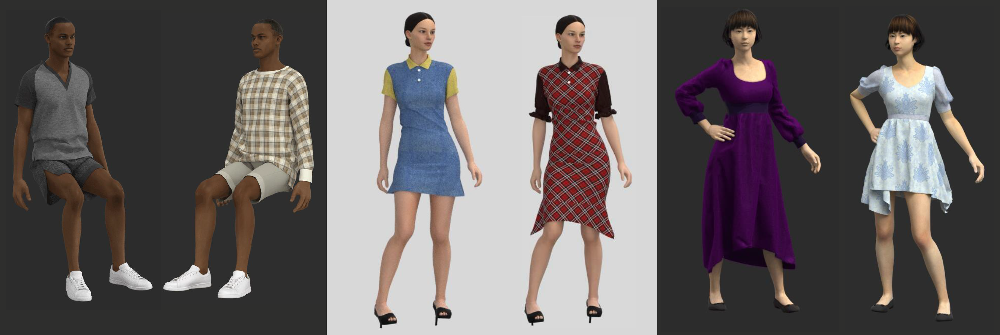
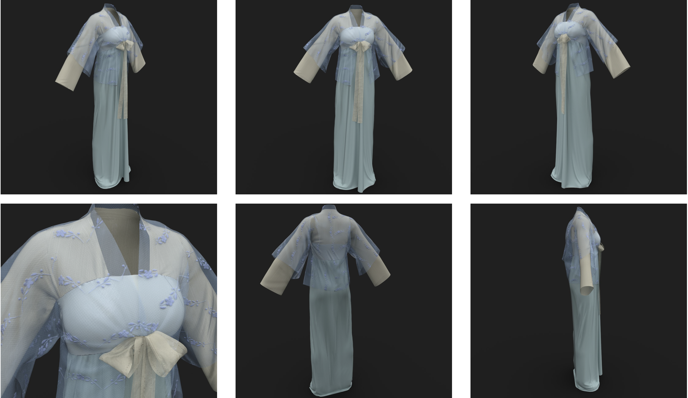
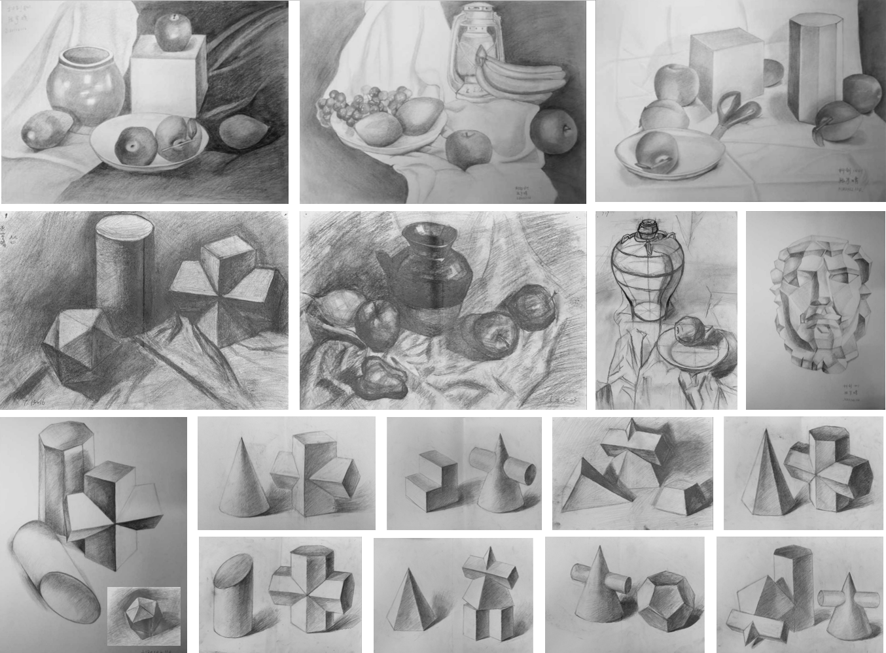

## 3D modeling
This is a project from the "Scene Design and Representation" course. Both high and low poly architectural models were created using Maya, with normal mapping baked using Marmoset. PBR materials were intricately developed in Substance Painter and the final rendering was executed in Unity.

## Cloth design
This is a project from the "Character Design" course. The clothing pattern making and simulation were conducted using Style3D, with detailed sculpting carried out in Zbrush.

## Digital painting

## Watercolor

## Sketch

