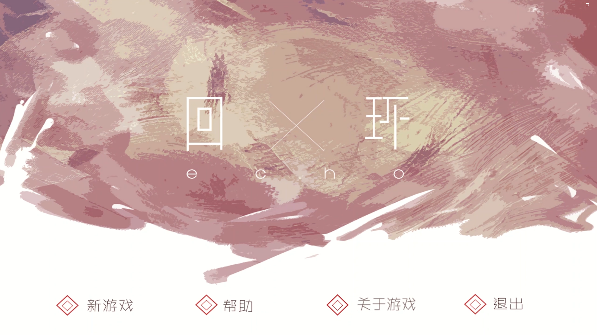
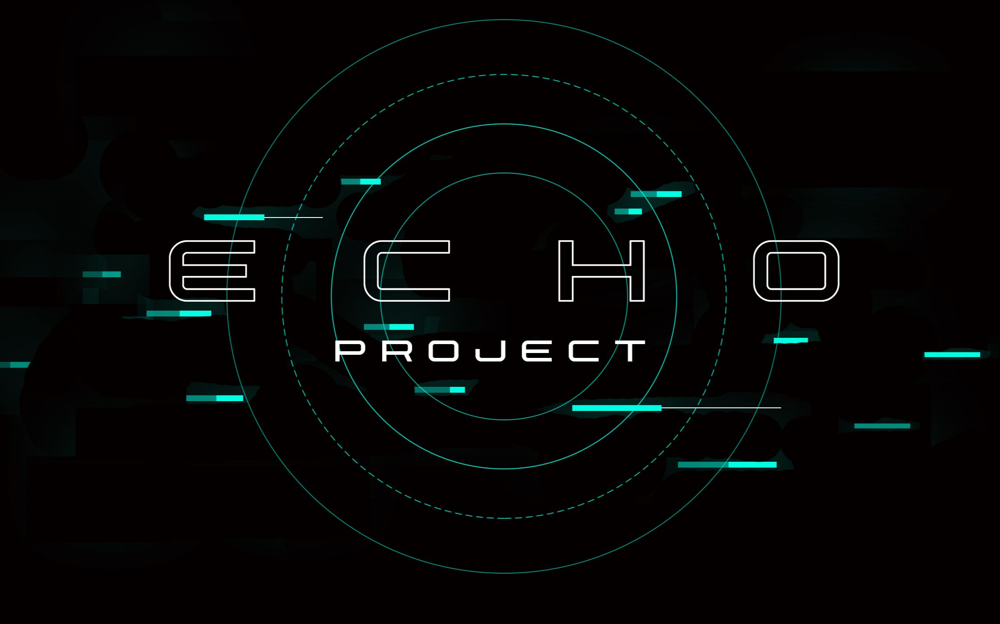
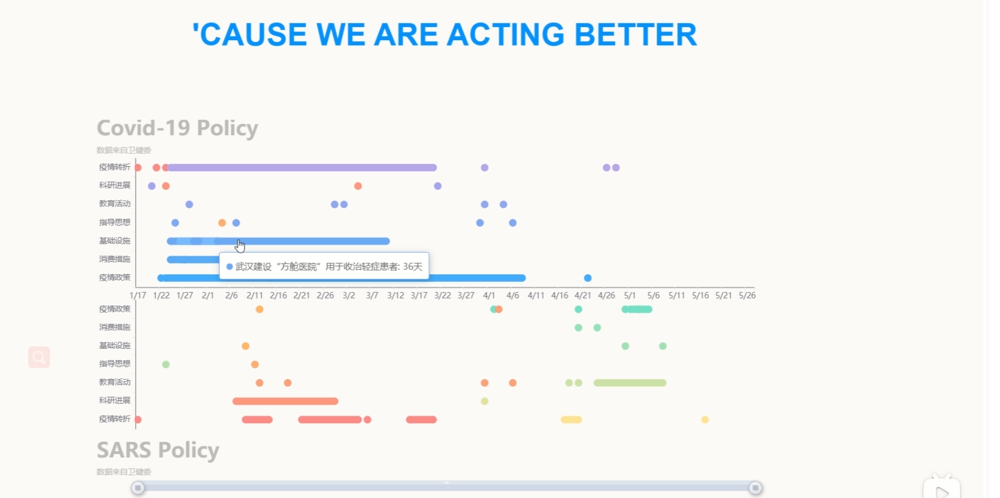



Education
======

### M.S. in Computer Science and Technology
Sep. 2022 - Exp. Mar. 2025
* State Key Lab of CAD&CG, Zhejiang University.
* Advisor: Prof. [Xiaogang Jin](http://www.cad.zju.edu.cn/home/jin/)

### B.S. in Digital Media Technology
Sep. 2018 - Jun. 2022
* ACEE, Chu Kochen Honors College, Zhejiang University.
* The College of Computer Science and Technology, Zhejiang University.

Internship
======
### Tencent (IEG)
July. 2024 - 

### miHoYo
Apr. 2024 - July. 2024
  * AIGC Algorithm Engineer
  * Duties includes: texture refinement and generation for characters

### Style3D
Feb. 2022 - Mar. 2023
  * Duties included: cloud-based cloth simulation
  * Advisor: Prof. Huaming Wang
  

Publications
======
*Equal contribution †Corresponding author

1. <b>DreamMat: High-quality PBR Material Generation with Geometry- and Light-aware Diffusion Models</b>  
  <b>Yuqing Zhang*</b>, <a href="https://liuyuan-pal.github.io/">Yuan Liu*</a>, Zhiyu Xie, Lei Yang, Zhongyuan Liu, Mengzhou Yang, Runze Zhang, Qilong Kou, <a href="https://clinplayer.github.io/">Cheng Lin</a>, <a href="https://engineering.tamu.edu/cse/profiles/Wang-Wenping.html">Wenping Wang</a>, <a href="http://www.cad.zju.edu.cn/home/jin/">Xiaogang Jin†</a>  
  ACM Transactions on Graphics (Proc. Siggraph 2024)  
  <a href="https://arxiv.org/abs/2405.17176">Paper</a> | <a href="https://zzzyuqing.github.io/dreammat.github.io/">Project Page</a> | <a href="https://github.com/zzzyuqing/DreamMat">Code</a>  

2. <b>Real-time Collision Detection between General SDFs</b>  
  Pengfei Liu*, <b>Yuqing Zhang*</b>, <a href="https://drhewang.com/">He Wang</a>, Milo K. Yip, Elvis Liu, <a href="http://www.cad.zju.edu.cn/home/jin/">Xiaogang Jin†</a>  
  Computer-Aided Geometric Design (Best Paper Award for GMP'2024)  
  <a href="http://www.cad.zju.edu.cn/home/jin/papers/Real_Time_CD_between_SDFs.pdf">Paper</a> |<a href="https://dlpf.github.io/sdf-collision.github.io/"> Project Page</a>    

3. <b>Deformable 3D Gaussians for High-fidelity Monocular Dynamic Scene Reconstruction</b>  
  <a href="https://github.com/ingra14m">Ziyi Yang</a>, Xinyu Gao, Wen Zhou, Shaohui Jiao,  <b>Yuqing Zhang</b>, <a href="http://www.cad.zju.edu.cn/home/jin/">Xiaogang Jin†</a>  
  CVPR 2024  
  <a href="https://arxiv.org/abs/2309.13101">Paper</a> | <a href="https://ingra14m.github.io/Deformable-Gaussians/">Project Page</a> | <a href="https://github.com/ingra14m/Deformable-3D-Gaussians">Code</a>  

4. <b>Model-based Crowd Behaviors in Human-solution Space</b>  
Wei Xiang, <a href="https://drhewang.com/">He Wang</a>, <b>Yuqing Zhang</b>, Milo K. Yip, <a href="http://www.cad.zju.edu.cn/home/jin/">Xiaogang Jin†</a>  
  Computer Graphics Forum 2023  
  <a href="https://diglib.eg.org:8443/server/api/core/bitstreams/37b310ac-b9d0-42c7-8505-d281e3d8fc51/content">Paper</a> | <a href="http://www.cad.zju.edu.cn/home/jin/cgf2023/cgf2023.htm">Project Page</a> | <a href="http://www.cad.zju.edu.cn/home/jin/cgf2023/demo.mp4">Video</a> 

5. <b>Automatic Pose and Wrinkle Transfer for Aesthetic Garment Display</b>  
Luyuan Wang, Honglin Li, Qinjie Xiao, Xinran Yao, Xiaoyu Pan, <b>Yuqing Zhang</b>, <a href="http://www.cad.zju.edu.cn/home/jin/">Xiaogang Jin†</a>  
  Computer-Aided Geometric Design 2021  
  <a href="http://www.cad.zju.edu.cn/home/jin/cagd2021/paper.pdf">Paper</a> | <a href="http://www.cad.zju.edu.cn/home/jin/cagd2021/cagd2021.htm">Project Page</a> | <a href="https://github.com/Dancingmader/3D-High-quality-Garment-Dataset">Dataset</a> 

Skills
======
* Maya, Blender, Substance Painter, Zbrush, Marmoset, Style3D/Cloth3D, Unity
* C++, Python, C#
* CUDA, Shader

Projects
======
* <b> Game design:</b>

  

  

  
A project for the "Game Programming Design" course, this is a LowPoly-style, first-person 3D narrative-driven puzzle game. Players begin their journey in the afterlife at the Reincarnation Services Office, following the protagonist, a painter, through four paintings representing Spring, Summer, Autumn, and Winter. They explore the worlds within the paintings, retracing the past and making amends for regrets. Implemented in Unity, this was a collaborative project involving eight people, with myself serving as the lead programmer. 
  <a href="https://www.bilibili.com/video/BV1nf4y1p72Z/">demo </a>

  

  

  

  
A project for the "Human–Computer Interaction" course, this is a 3D rhythm-based mobile game where players control a bouncing ball in time with the music through various interaction methods to avoid obstacles and hit treasures. Implemented in Unity, this was a collaborative project involving four people, with myself serving as the lead programmer. 
  <a href="https://www.bilibili.com/video/BV1r54y1b7wN/">demo </a>

  

  

  

  
A project for the "Computer Graphics" course, this is a racing game developed using OpenGL and C++, with in-game rendering, collision detection, and animation all implemented without the use of libraries. This was a collaborative project involving four people, where I was responsible for PBR asset creation and rendering.
  <a href="https://www.bilibili.com/video/BV1N5411a7rn/">demo </a>

  

  

  

  
A project for the "C Programming Language" course, this is a 2D bullet hell game where  players earn points by successfully shooting at moving saucers, but the game ends if they are hit. The entire game was developed solely in C language, utilizing a minimalist graphics library that only supports line and circle drawing. It features a rudimentary user system and a robust game design logic.
  <a href="https://www.bilibili.com/video/BV1jYgCeiEjc/">demo </a>

  

* <b>Website design:</b>

  

  

  
A project for the "Cross-Media Visualization" course, this is a visual analysis system constructed using Vue. It takes into account both medical and sociological perspectives and contrasts the similarities and differences between COVID-19 and SARS in aspects of regional transmission, epidemic control, and topic discussions.
  <a href="https://www.bilibili.com/video/BV1mo4y1o7Gx/">demo </a>

  

  

  

  
A project for the "C Programming Language" course, this is a 2D bullet hell game where players earn points by successfully shooting at moving saucers, but the game ends if they are hit. The entire game is developed solely in C language, utilizing a minimalist graphics library that only supports line and circle drawing. It features a rudimentary user system and a robust game design logic.
  <a href="https://www.bilibili.com/video/BV1bf4y1n7NX/">demo </a>

  

  

  

  
A project for the "Digital Audio and Video" course, this is a an interactive music website utilizing Google Magenta's MusicVAE model to generated music and a 2D music parkour game map is dynamically constructed.
  <a href="https://www.bilibili.com/video/BV1Sh411p7eB/">demo </a>

  

